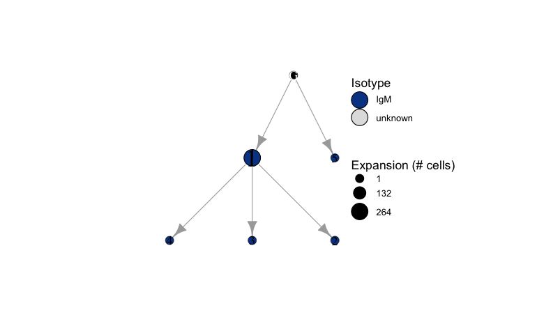
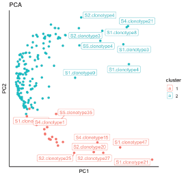
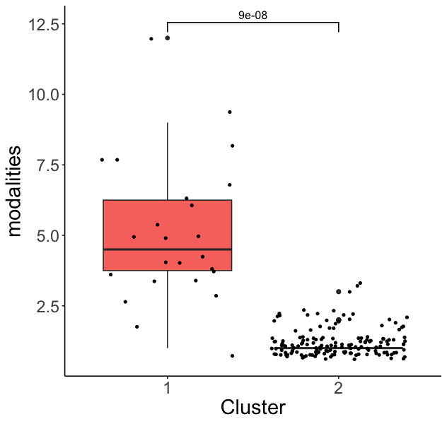

```{r setup, echo = FALSE, eval = TRUE}
# Set global options
knitr::opts_chunk$set(eval = TRUE, include = TRUE, echo = TRUE, message = FALSE, warning = FALSE, error = FALSE, dpi = 72)
# Define custom hooks for handling errors, warnings, and messages during knitting
knitr::knit_hooks$set(
   error = function(x, options){
     paste('\n\n<div class="alert alert-danger">',
           gsub('##', '\n', gsub('^##\ Error', '**Error**', x)),
           '</div>', sep = '\n')},
   warning = function(x, options){
     paste('\n\n<div class="alert alert-warning">',
           gsub('##', '\n', gsub('^##\ Warning:', '**Warning**', x)),
           '</div>', sep = '\n')},
   message = function(x, options){
     paste('\n\n<div class="alert alert-info">',
           gsub('##', '\n', x),
           '</div>', sep = '\n')})
```

<style>
#TOC::before {
  content: "";
  display: block;
  height: 150px;
  background-image: url("imgs/main/logo.png");
  background-size: contain;
  background-position: center center;
  background-repeat: no-repeat;
}
</style>

<style>
pre code, pre, code {
  white-space: pre !important;
  overflow-x: scroll !important;
  word-break: keep-all !important;
  word-wrap: initial !important;
}
</style>

```{r load-scripts, include = FALSE}
# Source AntibodyForests scripts
source("~/Documents/GitHub/AntibodyForests/R/VDJ_import_IgBLAST_annotations.R")
source("~/Documents/GitHub/AntibodyForests/R/VDJ_to_AIRR.R")
source("~/Documents/GitHub/AntibodyForests/R/Af_build.R")
source("~/Documents/GitHub/AntibodyForests/R/Af_sync_nodes.R")
source("~/Documents/GitHub/AntibodyForests/R/Af_plot_tree.R")
source("~/Documents/GitHub/AntibodyForests/R/Af_add_node_feature.R")
source("~/Documents/GitHub/AntibodyForests/R/Af_plot_PLM.R")
source("~/Documents/GitHub/AntibodyForests/R/Af_PLM_dataframe.R")
source("~/Documents/GitHub/AntibodyForests/R/Af_distance_scatterplot.R")
source("~/Documents/GitHub/AntibodyForests/R/Af_get_sequences.R")
source("~/Documents/GitHub/AntibodyForests/R/Af_compare_methods.R")
source("~/Documents/GitHub/AntibodyForests/R/Af_compare_within_repertoires.R")
source("~/Documents/GitHub/AntibodyForests/R/Af_metrics.R")
source("~/Documents/GitHub/AntibodyForests/R/igraph_to_phylo.R")
source("~/Documents/GitHub/AntibodyForests/R/Af_cluster_metrics.R")
source("~/Documents/GitHub/AntibodyForests/R/Af_cluster_node_features.R")
source("~/Documents/GitHub/AntibodyForests/R/Af_distance_boxplot.R")
source("~/Documents/GitHub/AntibodyForests/R/Af_compare_across_repertoires.R")
source("~/Documents/GitHub/AntibodyForests/R/VDJ_3d_properties.R")
source("~/Documents/GitHub/AntibodyForests/R/Af_edge_RMSD.R")
source("~/Documents/GitHub/AntibodyForests/R/VDJ_integrate_bulk.R")
library(magrittr)
```
<br>

## Introduction

<div class=text-justify>

This vignette provides a detailed explanation of the main functions from the AntibodyForests package, including the `VDJ_build()` function from the [Platypus package](https://github.com/alexyermanos/Platypus). These functions are designed for importing single-cell V(D)J sequencing data from 10x Genomics, constructing lineage trees, comparing the structure of these trees within and across repertoires, and incorporating features of protein structure and evolutionary likelihood from Protein Language Models. Throughout this vignette, the dataset outlined by [Neumeier et al. (2022)](https://doi.org/10.1073/pnas.2113766119) and [Kim et al. (2022)](https://www.nature.com/articles/s41586-022-04527-1) will be used.  

<br>
</div>


## Installation

<div class=text-justify>

Both Platypus and AntibodyForests can be installed from CRAN.

```{r, eval = FALSE}
#Install from CRAN
install.packages("Platypus")
install.packages("AntibodyForests")
```

```{r, eval = FALSE}
#Load the libraries
library(Platypus)
library(AntibodyForests)
```

```{r installation, echo = FALSE, eval = FALSE}
# List of CRAN packages required to run all functions
CRAN_packages <- c("Platypus", "alakazam", "ape", "base",
                   "base64enc", "BiocManager", "dplyr", 
                   "grDevices", "gtools", "igraph", 
                   "jsonlite", "knitr", "parallel", 
                   "phangorn", "scales", "stats", 
                   "stringdist", "stringr", "utils")

# List of Bioconductor packages required to run all functions
Bioconductor_packages <- c("Biostrings", "msa")

# Iterate through packages
for(package in c(CRAN_packages, Bioconductor_packages)){
  # Check if the current packages is already installed
  if(!requireNamespace(package, quietly = TRUE)){
    # Install CRAN packages if not installed
    if(package %in% CRAN_packages){install.packages(package)}
    # Install Bioconductor packages if not installed
    if(package %in% Bioconductor_packages){BiocManager::install(package)}
  }
}

```
<br>
</div>


## Quick start

<div class=text-justify>

This quick start gives a short use case of AntibodyForests. 10x output of five mouse immunized with Ovalbumin (OVA) from [Neumeier et al. (2022)](https://doi.org/10.1073/pnas.2113766119) are used to create a VDJ dataframe with [Platypus](https://github.com/alexyermanos/Platypus). AntibodyForests is used to create lineage trees for each B cell clonotype, these trees are then clustered and the difference in topology between the clusters is analyzed.  

```{r quick-start1, eval = FALSE}
# Import 10x Genomics output files into VDJ dataframe and only keep cells with one VDJ and one VJ transcript
# For each clone, trim germline sequence and replace CDR3 region in germline with most-frequently observed CDR3 sequence
VDJ_OVA <- Platypus::VDJ_build(VDJ.directory = "10x_output/VDJ/",
                     remove.divergent.cells = TRUE,
                     complete.cells.only = TRUE,
                     trim.germlines = TRUE)

# Build lineage trees for all clones present in the VDJ dataframe with the default algorithm
AntibodyForests_OVA_default <- Af_build(VDJ = VDJ_OVA,
                                          construction.method = "phylo.network.default")
```

```{r, quick-start2, eval = F}
# Plot one of the lineage trees, constructed with the `phylo.network.default' method
Af_plot_tree(AntibodyForests_object = AntibodyForests_OVA_default,
                     sample = "S1",
                     clonotype = "clonotype2")
```
{width=80%}

```{r, quick-start3, eval = F}
# Cluster the trees in the repertoire based on the euclidean distance between various metrics of each tree
out <- Af_compare_within_repertoires(input = AntibodyForests_OVA_default,
                                     min.nodes = 5,
                                     distance.method = "euclidean",
                                     distance.metrics = c("mean.depth", "sackin.index", "spectral.density"),
                                     clustering.method = "mediods",
                                     visualization.methods = "PCA",
                                     plot.label = T)

# Analyze the difference between the clusters based on the calculated sackin.index
plots <- Af_cluster_metrics(input = AntibodyForests_OVA_default,
                   clusters = out$clustering,
                   metrics = c("spectral.density"),
                   min.nodes = 5,
                   significance = T)

```

```{r, quick-start4, eval=FALSE}
# Plot the PCA colored on the assigned clusters
out$plots$PCA_clusters
```

{width=50%}

```{r, quick-start5, eval=FALSE}
# Plot the different number of modalities between the clusters
plots$modalities
```

{width=50%}

<br>
</div>


## 1. Import 10x output into VDJ dataframe with the `VDJ_build()` function

### Summary {.tabset}  

<div class=text-justify>

The **`VDJ_build()`** function imports Cell Ranger output into an R dataframe, priming the data for downstream analyses. It is optimized for Cell Ranger v7 and older versions and is suitable for B and T cell repertoires. Upon execution, the function generates a VDJ dataframe where VDJ and VJ transcripts are paired (if present) in each row, with each row representing a single cell. Post VDJ dataframe construction, a table is displayed on the console, delineating the number of filtered cells, contingent upon the `remove.divergent.cells` and `complete.cells.only` parameters.  
<br>
For seamless integration with functions such as the `Af_build()` function (discussed next), it is strongly recommended to set the `remove.divergent.cells` and `complete.cells.only` parameters to TRUE. Cells with more than one VDJ or VJ transcript, referred to as 'divergent cells', typically represent doublets that may arise during the single-cell sorting, or show dual expression of kappa and lambda light chains. Such occurrences are rare, accounting for only 0.2-0.5% of peripheral blood B cells, as reported by [Giachino et al. (1995)](https://doi.org/10.1084/jem.181.3.1245). Cells harboring both a single VDJ and a VJ transcript may be included for comprehensive downstream analyses.  
<br>
The output of 10x Genomics contains one output folder per run/sample. In each sample folder, the following files should be present in order to run the `VDJ_build()` function successfully. More information on the outputs of 10x Genomics can be found [on this page](https://www.10xgenomics.com/support/software/cell-ranger/latest/analysis/outputs/cr-5p-outputs-overview-vdj).  
<br>

* `filtered_contig_annotations.csv`  
This CSV file contains the amino acid and nucleotide framework (FWRs) and complementarity determining regions (CDRs) of the contig sequences stored in the `filtered_contig.fasta` file. These annotations are required to obtain the trimmed V(D)J sequences.  
* `filtered_contig.fasta`  
This FASTA file contains the contig sequences from barcodes that passed the filtering steps. These contigs are annotated in the `filtered_contig_annotations.csv`.  
* `consensus_annotations.csv`  
This CSV file contains the amino acid and nucleotide framework (FWRs) and complementarity determining regions (CDRs) of the consensus sequences stored in the `consensus.fasta` file.  
* `consensus.fasta`  
This FASTA file contains the consensus sequence of each assembled contig, which is identical to the sequence of the most frequent exact subclonotype, in which an exact subclonotype is defined as a group of cells with identical V(D)J transcripts.  
* `concat_ref.fasta`  
This FASTA file contains the concatenated V(D)J reference segments for the segments detected on each consensus sequence. Note, these reference sequences serve as an **approximate** reference for each consensus sequence, and need to be aligned and trimmed in order to have the same length as the consensus sequence (see `trim.and.align` parameter).  
<br>
NOTE: In older versions of Cell Ranger (older than v6), the FWR1-4 and CDR1-3 regions are not annotated. In this scenario, the `all_contig_annotations.json` file will be employed to obtain the 'L-REGION+V-REGION' and 'J-REGION' annotations. The raw sequences can now be trimmed using the 'L-REGION+V-REGION' start and 'J-REGION' end indices. If the `all_contig_annotations.json` file is not found in the sample/run directory, the columns with the trimmed sequences will remain empty and a warning message is printed.  
<br>

</div>


### Parameters {.tabset}  

<div class=text-justify>

`VDJ.directory`

* **Description:** Path to the parent directory containing the output folders (one folder for each run/sample) of Cell Ranger (note: when specified, the `VDJ.sample.list` parameter should not be specified).  
* **Example:** `"/path/to/VDJ/directory"`  
* **Default:** *None*  
<br>

`VDJ.sample.list`

* **Description:** Character vector of the paths to the output folders (one folder for each run/sample) of Cell Ranger (note: when specified, the `VDJ.directory` parameter should not be specified).  
* **Example:** `c("/path/to/sample1", "/path/to/sample2")`  
* **Default:** *None*  
<br>

`remove.divergent.cells`

* **Description:** If `TRUE`, cells with more than one VDJ transcript or more than one VJ transcript will be excluded from the VDJ dataframe.  
* **Default:** `FALSE`  
<br>

`complete.cells.only`

* **Description:** If `TRUE`, only cells with both a VDJ transcript and a VJ transcript are included in the VDJ dataframe.  
* **Default:** `FALSE`  
<br>

`trim.germlines`

* **Description:** If `TRUE`, the raw germline sequence of each clone will be aligned with the consensus sequence of that clone serving as the reference sequence, utilizing the `Biostrings::pairwiseAlignment()` function. The alignment conducted will be of the 'global-local' type, therebyy trimming the raw germline sequence.  
* **Default:** `FALSE`  
<br>

`fill.germline.CDR3`

* **Description:** If TRUE, the trimmed germline sequence of each clone will be aligned with the most frequently observed sequence for the CDR3 region of that clone serving as the reference sequence, utilizing the `Biostrings::pairwiseAlignment()` function. The alignment conducted will be of the 'global-local' type, thereby selecting the CDR3 region from the trimmed germline sequence. After the alignment, the germline CDR3 sequence is replaced by the most frequently observed CDR3 sequence, in order to obtain germline sequences that are more likely to encode producible and productive antibodies.  
* **Default:** `FALSE`  
<br>

`gap.opening.cost`

* **Description:** The cost for opening a gap when aligning and trimming germline sequences using the consensus sequences. A cost of `Inf` will result in a gapless alignment.  
* **Default:** `10`  
<br>

`gap.extension.cost`

* **Description:** The cost for extending a gap in when aligning and trimming germline sequences. A cost of `Inf` will result in a gapless alignment.  
* **Default:** `4`  
<br>

</div>


### Example {.tabset}

<div class=text-justify>

In this example, divergent cells are filtered out, and only cells with both a VDJ and VJ transcript are included in the VDJ dataframe. The resulting VDJ dataframe contains *17,891 cells* with both a single VDJ and VJ transcript. The number of cells filtered out due to the lack of VDJ and VJ transcripts, referred to as 'incomplete cells', is shown in the right column of the printed table. Since a cell can have a double VDJ or VJ transcript or may lack a VDJ or VJ transcript, such a cell can be included in both the counts of 'divergent cells' and 'incomplete cells'. Note that, as a result, the sum of these counts may not exactly match the difference in the number of rows between the dataframes. Additionally, for each clone, the germline sequences are trimmed, and an additional germline sequence column is added in which the CDR3 region is replaced by the most frequently observed CDR3 sequence in that clone.
```{r vdj_build-example-3-code, eval = FALSE}
# Read in data, keep only complete, non-divergent cells and trim germline sequences
VDJ_OVA <- Platypus::VDJ_build(VDJ.directory = "10x_output/VDJ/",
                     remove.divergent.cells = TRUE,
                     complete.cells.only = TRUE,
                     trim.germlines = TRUE,
                     fill.germline.CDR3 = TRUE)
```
<br>

```{r vdj_build-example-3-message, echo = FALSE, results = "asis"}
# Print number of filtered cells/barcodes 
warning("Please be aware of the number of cells excluded, when 'remove.divergent.cells' or 'complete.cells.only' is set to TRUE:\n")
print(knitr::kable(data.frame(divergent.cells = c(360, 295, 79, 183 ,526), 
                              incomplete.cells = c(708, 503, 387, 380, 1113),
                              row.names = c("S1", "S2", "S3", "S4", "S5"))))
```
<br>

For illustration, the dummy VDJ dataframe below contains a few columns of the first 10 rows of S1:
```{r vdj_build-example-3-df, echo = FALSE}
# Load the example VDJdataframe
load("objects/VDJ_OVA_dummy_3.RData")
knitr::kable(head(VDJ_OVA_dummy_3[,c("sample_id", "barcode", "isotype", "clonotype_id", "clonotype_frequency", "VDJ_vgene", "VDJ_jgene")], 10))
```
<br>

</div>


## 2. Construct lineage trees in repertoire-wide manner with the `Af_build()` function

### Summary {.tabset}

<div class=text-justify>

The **`Af_build()`** function infers B/T cell evolutionary networks for all clonotypes in a VDJ dataframe, thereby providing insights into the evolutionary relationships between BCR/TCR sequences from each clonotype. Upon execution, the function generates an AntibodyForests object containing lineage trees, sequences, and other specified features for downstream analyses. The resulting object can be used for visualization, comparison, and further analysis of B cell repertoires.  
<br>
For all clonotypes, the unique (combination of) sequences are selected, which will be nodes in the lineage tree. Until now, five algorithms have been implemented to construct B cell lineage trees from this list of sequences. Three construction algorithms are based on a pairwise distance matrix: 'phylo.network.default', 'phylo.network.mst', and 'phylo.tree.nj'. If the `string.dist.metric` is specified, the distance matrices are calculated using the `stringdist::stringdistmatrix()` function; if the `dna.model` or `aa.model` is specified, the distance matrices are calculated using the `ape::dist.dna()` or `phangorn::dist.ml()` function, respectively. Two construction algorithms are based on a multiple sequence alignment (msa): 'phylo.tree.mp' and 'phylo.tree.ml'. The msa is created with the `msa::msa()` function. The five algorithms are explained in the description of the `construction.method` parameter below.  
<br>
In addition, there is also the option to import pre-constructed lineage trees from an IgPhyML output file into an AntibodyForests object, which enables to comparison of trees created with different construction methods on the same sequencing data in a repertoire-wide manner. IgPhyML is a command-line tool that infers maximum likelihood trees using a phylogenetic codon substitution model specific for antibody lineages, as explained by [Hoehn *et al.* (2017)](https://doi.org/10.1534/genetics.116.196303). Some functions have been included to create the appropriate input files from IgPhyML from 10x Genomics outputs, by running the IgBLAST tool and integrating the output with the VDJ dataframe. These function are discussed in the [supplementary of this vignette](#supplementary-i).
<br>

</div>

### Parameters {.tabset}

<div class=text-justify>

`VDJ`

* **Description:** VDJ dataframe as obtained from the `VDJ_build()` function or a dataframe that contain the columns specified in the `sequence.columns`, `germline.columns`, and `node.features` column.  
* **Example:** `VDJ_df`  
* **Default:** *None*  
<br>

`sequence.columns`

* **Description:** Sequence column(s) in the VDJ dataframe that contain the sequences that will be used to infer B cell lineage trees. The sequences should be of the same type (DNA or protein), otherwise, an error message will be returned.  
* **Example:** `c("VDJ_sequence_aa_trimmed", "VJ_sequence_aa_trimmed")`  
* **Default:** `c("VDJ_sequence_nt_trimmed", "VJ_sequence_nt_trimmed")`  
<br>

`germline.columns`

* **Description:** Germline column(s) in the VDJ dataframe that contain the sequences that will be the starting points (roots) of the trees. The germline columns should be in the corresponding order with the columns specified by the `sequence.columns' parameter, and should be of the same type. Note: if the germline sequences are not trimmed using the consensus sequences, the distance between the nodes and the germline node will be overestimated.  
* **Example:** `c("VDJ_germline_aa_trimmed", "VJ_germline_aa_trimmed")`  
* **Default:** `c("VDJ_germline_nt_trimmed", "VJ_germline_nt_trimmed")`  
<br>

`concatenate.sequences`

* **Description:** If `TRUE`, sequences from multiple sequence columns are concatenated into one sequence for single distance matrix calculations/multiple sequence alignments. If `FALSE`, a distance matrix is calculated/multiple sequence alignment is performed for each sequence column separately.  
* **Default:** `FALSE`  
<br>

`node.features`

* **Description:** Column name(s) in the VDJ dataframe which should be imported into the AntibodyForests object, i.e. for plotting of lineage trees later on.  
* **Example:** `c("VDJ_vgene", "VDJ_dgene", "VDJ_jgene", "isotype")`  
* **Default:** `"isotype"` (if present)  
<br>

`string.dist.metric`

* **Description:** Specifies the metric used to calculate pairwise string distances between sequences with the `stringdist::stringdistmatrix()` function. This parameter is applicable only when a pairwise DNA or protein distance matrix will be calculated and when the `dna.model` and `aa.model` parameters are not specified. Options include:  
<br>
  + **`"lv"`** (Levenshtein distance / edit distance)  
  + **`"dl"`** (Damerau-Levenshtein distance)  
  + **`"osa"`** (Optimal String Alignment distance)  
  + **`"hamming"`** (Hamming distance)  
  + **`"qgram"`** (Q-gram distance)  
  + **`"cosine"`** (Cosine distance)  
  + **`"jaccard"`** (Jaccard distance)  
  + **`"jw"`** (Jaro-Winkler distance)  
* **Default:** `"lv"`  
<br>

`dna.model`

* **Description:** When a distance-based method is specified in the `construction.method` parameter, an evolutionary DNA model can be specified that is to be used during the pairewise distance calculation. Currently, the following models are included: 'raw', 'N', 'TS', 'TV', 'JC69', 'K80', 'F81', 'K81', 'F84', 'BH87', 'T92', 'TN93', 'GG95', 'logdet', 'paralin', 'indel', and 'indelblock'. The pairwise-distance matrix is calculated using the `ape::dist.dna()` function. When the `construction.method` parameter is set to `phylo.tree.ml`, a nucleotide subsitution model can be specified that is to be use during the maximum likelihood tree-inference. Currently, the following nucleotide substitution models are included: 'JC', 'F81', 'K80', 'HKY', 'TrNe', 'TrN', 'TPM1', 'K81', 'TPM1u', 'TPM2', 'TPM2u', 'TPM3', 'TPM3u', 'TIM1e', 'TIM1', 'TIM2e', 'TIM2', 'TIM3e', 'TIM3', 'TVMe', 'TVM', 'SYM', and 'GTR'. When set to `"all"`, all available nucleotide substitution models will be tested using the `phangorn::modelTest()` function, after which the result is given to the `phangorn::pml_bb()` function for the maximum likelihood tree inference.  
* **Example:** `"all"`  
* **Default:** *None* (when a distance-based method is specified with the `construction.method`parameter) and `"all"` (when the `construction.method` parameter is set to "phylo.tree.ml").  
<br>

`aa.model`

* **Description:** When a distance-based method is specified in the `construction.method` parameter, an evolutionary protein model can be specified that is to be used during the pairwise distance calculation. Currently, the following models are included: "WAG", "JTT", "LG", "Dayhoff", "VT", "Dayhoff_DCMut" and "JTT-DCMut". The pairwise-distance matrix is calculated using the `phangorn::dist.ml()` function. When the `construction.method` parameter is set to 'phylo.tree.ml', an amino acid subsitution model can be specified that is to be use during the maximum likelihood tree-inference. Currently, the following amino acid substitution models are included: "WAG", "JTT", "LG", "Dayhoff", "VT", "Dayhoff_DCMut" and "JTT-DCMut". When set to `"all"`, all available nucleotide substitution models will be tested using the `phangorn::modelTest()` function, after which the result is given to the `phangorn::pml_bb()` function for the maximum likelihood tree inference.  
* **Example:** `"all"`  
* **Default:** *None* (when a distance-based method is specified with the `construction.method`parameter) and `"all"` (when the `construction.method` parameter is set to "phylo.tree.ml").  
<br>

`codon.model`

* **Description:** Specifies the codon substitution model to be used during maximum likelihood tree infrence. This parameter can only be specified when the `construction.method` is set to "phylo.tree.ml" and when columns with nucleotide sequences are specified in the `sequence.columns` and `germline.columns` parameters. Currently, three codon substution models are available: 'M0' (which assumes a non-distinct non-synonymous/synonymous ratio (ω), 'M1a' (that estimates two different ω classes: ω = 1 & ω < 1), and 'M2a' (that estimates three different ω classes: ω < 1, ω = 1, positive selection ω > 1).
* **Example:** `"M0"`  
* **Default:** *None*  
<br>

`construction.method`

* **Description:** Denotes the approach and algorithm used to convert the distance matrix or multiple sequence alignment into a lineage tree. Currently, there are six options for this paramater:  
<br>
  + **`"phylo.network.default"`**  
  This approach employs a mst-like algorithm to construct a tree evolutionary network. In this method, the germline node is positioned at the top of the tree, and nodes with the minimum distance to any existing node in the tree are linked iteratively.  
  + **`"phylo.network.mst"`**  
  This method utilizes the minimum spanning tree (MST) algorithm from the `ape::mst()` function. It constructs networks with the minimum sum of edge lengths/weights by iteratively adding edges to the network in ascending order of edge weights, while ensuring that no cycles are formed. The network is then reorganized into a germline-rooted lineage tree.  
  + **`"phylo.tree.nj"`**  
  This approach employs the neighbor-joining (NJ) algorithm from the `ape::nj()` function. It constructs phylogenetic trees by joining pairs of nodes with the minimum distance, resulting in a bifurcating tree consisting of internal nodes (representing unrecovered sequences) and terminal nodes (representing the recovered sequences).  
  + **`"phylo.tree.mp"`**  
  This method utilizes the maximum-parsimony (MP) algorithm from the `phangorn::pratchet()` function. It constructs phylogenetic trees by minimizing the total number of edits required to explain the observed differences among sequences.  
  + **`"phylo.tree.ml"`**  
  This approach utilizes the maximum-likelihood (ML) algorithm from the `phangorn::pml_bb()` function. It constructs phylogenetic trees by estimating the tree topology and branch lengths that maximize the likelihood of observing the given sequence data under a specified evolutionary model.  
  + **`"phylo.tree.IgPhyML"`**  
  With this option, no trees/networks are inferred directly. Instead, trees are imported from an [IgPhyML](https://doi.org/10.1534/genetics.116.196303) output file specified by the `IgPhyML.output.file` parameter.  
* **Default:** `"phylo.network.default"` (if the `IgPhyML.output.file` parameter is not specified) and `"phylo.tree.IgPhyML"` (if the `IgPhyML.output.file` parameter is specified)  
<br>

`IgPhyML.output.file`

* **Description:** Specifies the path to the IgPhyML output file, from which the trees will be imported if `construction.method` is not specified or set to `"phylo.tree.IgPhyML"`. 
* **Example:** `"path/to/IgPhyML/output/file.tab"`  
* **Default:** *None*  
<br>

`resolve.ties`

* **Description:** Denotes how ties are handled during the conversion of the distance matrix into lineage trees when `construction.method` is set to "phylo.network.default". Ties occur when an unlinked node, which is to be linked to the tree next, shares identical distances with multiple previously linked nodes in the lineage tree. If a vector is provided, ties will be resolved in a hierarchical manner, following the order specified in the vector. If a tie could not be resolved, the node is connected to all nodes, thereby creating a cyclic structure, and a warning message is printed after creation of the AntibodyForests object. There are seven ways to handle ties:  
<br>
  + **`"min.expansion"`**  
  Selects the node(s) with the smallest size.  
  + **`"max.expansion"`** 
  Selects the node(s) with the biggest size.  
  + **`"min.germline.dist"`**  
  Selects the node(s) with the smallest string distance to the germline node.  
  + **`"max.germline.dist"`** 
  Selects the node(s) with the biggest string distance to the germline node.  
  + **`"min.germline.edges"`**  
  Selects the node(s) with the lowest possible number of edges to the germline node.  
  + **`"max.germline.edges"`**  
  Selects the node(s) with the highest possible number of edges to the germline node.  
  + **`"min.descendants"`**  
  Selects the node(s) with the lowest possible number of descendants.  
  + **`"max.descendants"`**  
  Selects the node(s) with the highest possible number of descendants.  
  + **`"random"`** 
  Selects a random node.  
* **Default:** `c("max.expansion", "close.germline.dist", "close.germline.edges", "random")` (if the `construction.method` parameter is set to `"phylo.network.default"`)  
<br>

`remove.internal.nodes`

* **Description:** Denotes if and how internal nodes should be removed after constructing phylogenetic trees. There are four algorithms included to remove internal nodes:  
<br>
  + **`"zero.length.edges.only"`**  
  This option removes internal nodes that only have zero-length edges to terminal nodes.  
  + **`"connect.to.parent"`**  
  This option first removes internal nodes that have zero-length edges to terminal nodes. Subsequently, it connects all terminal nodes directly to the first parental sequence-recovered node found higher in the tree.  
  + **`"minimum.length"`** 
  This algorithm iteratively removes internal nodes by prioritizing edges with the minimum length for deletion.   
  + **`"minimum.cost"`**  
  Similar to the `"minimum.length"` option, this algorithm iteratively removes internal nodes. However, instead of prioritizing edges based solely on their length, it prioritizes edges that result in the minimum increase in the sum of all edge lengths. 
* **Default:** `"minimum.cost"` (when the `construction.method` parameter is set to `"phylo.tree.nj"`) and `"connect.to.parent"` (when the `construction.method` parameter is set to `"phylo.tree.mp"`, `"phylo.tree.ml"`, or `"phylo.tree.IgPhyML"`)  

</div>


### Examples {.tabset}

<div class=text-justify>

#### 1. Default  

In the example below, the chosen construction method, `"phylo.network.default"`, employs a mst-like algorithm for constructing evolutionary networks. Both the heavy and light chain sequences are used to construct the tree, these sequences are not concatenated. Additional features, such as isotype, are included (`node.features = "isotype"`) for downstream analyses. String distances are calculated using the Levenshtein distance metric to handle sequences with differing lengths or mutations. In the situation where a node that is to be added shares the same distance to multiple nodes in the tree, the tie resolution methods (`resolve.ties`) are employed in a hierarchical manner: first by maximum expansion (`"max.expansion"`), followed by proximity to the germline (`"close.germline.dist"`) and number of edges to the germline (`"close.germline.edges"`). The `"random"` option is included to prevent cyclic structures from being created in the lineage tree.

```{r AntibodyForests-example-default, eval = FALSE}
# Infer lineage trees for all clones using the 'phylo.network.default' construction method and using all default parameter settings
AntibodyForests_OVA_default <- Af_build(VDJ = VDJ_OVA,
                                               sequence.columns = c("VDJ_sequence_nt_trimmed", "VJ_sequence_nt_trimmed"),
                                               germline.columns = c("VDJ_germline_nt_trimmed", "VJ_germline_nt_trimmed"),
                                               concatenate.sequences = FALSE,
                                               node.features = "isotype",
                                               construction.method = "phylo.network.default",
                                               string.dist.metric = "lv",
                                               resolve.ties = c("max.expansion", "close.germline.dist", "close.germline.edges", "random"),
                                               parallel = TRUE)
```
<br>

#### 2. ML  

In this example, the construction method employs the Maximum Likelihood (ML) algorithm to infer evolutionary trees. The `dna.model` parameter is set to `"all"`, indicating that various DNA substitution models are considered during tree construction to find the one that best fits the data. The `remove.internal.nodes` parameter is set to `"connect.to.parent"`, which means that during tree construction, internal nodes will be pruned by connecting the descendant nodes directly to the parent node. 
```{r AntibodyForests-example-ML, eval = FALSE}
# Infer lineage trees for all clones using the 'phylo.tree.ml' construction method and using all default parameter settings
AntibodyForests_OVA_ml <- Af_build(VDJ = VDJ_OVA,
                                          sequence.columns = c("VDJ_sequence_nt_trimmed", "VJ_sequence_nt_trimmed"),
                                          germline.columns = c("VDJ_germline_nt_trimmed", "VJ_germline_nt_trimmed"),
                                          concatenate.sequences = FALSE,
                                          construction.method = "phylo.tree.ml",
                                          dna.model = "all",
                                          remove.internal.nodes = "connect.to.parent",
                                          parallel = TRUE)
```
<br>

#### 3. IgPhyML  {#AntibodyForests-example-6-IgPhyML}

In this final example, it is demonstrated how the construction method `"phylo.tree.IgPhyML"` can be used for compatibility with the IgPhyML tool. Unlike other methods where trees are inferred, this method imports trees directly from the specified IgPhyML output file (`IgPhyML.output.file = "data/OVA_scRNA-seq_data/VDJ/airr_rearrangement_igphyml-pass.tab"`). The IgPhyML tool only accepts VDJ sequences as input, which is why only the `"VDJ_sequence_nt_trimmed"` and `"VDJ_germline_nt_trimmed"` columns are selected. This ensures that the relevant DNA sequences are imported from the VDJ dataframe into the AntibodyForests object. It is important to note that the IgPhyML tool also employs a maximum likelihood algorithm, similar to the `"phylo.tree.ml"` method, but uses a model that is specifically adapted to antibody sequences. This specialized model provides more accurate phylogenetic reconstructions for antibody sequence data. 
```{r AntibodyForests-example-IgPhyML, eval = FALSE}
# Infer lineage trees for all clones using the 'phylo.tree.IgPhyML' construction method and using all default parameter settings
AntibodyForests_OVA_IgPhyML <- Af_build(VDJ = VDJ_OVA,
                                               sequence.columns = "VDJ_sequence_nt_trimmed",
                                               germline.columns = "VDJ_germline_nt_trimmed",
                                               construction.method = "phylo.tree.IgPhyML",
                                               IgPhyML.output.file = "data/OVA_scRNA-seq_data/VDJ/airr_rearrangement_igphyml-pass.tab",
                                               remove.internal.nodes = "connect.to.parent",
                                               parallel = TRUE)
```
<br>


</div>


## 3. Visualize lineage trees with the `Af_plot_tree()` function

### Summary {.tabset}

<div class=text-justify>

The **`Af_plot_tree()`** function retrieves the igraph object from the provided AntibodyForests object for the specified clone within the specified sample and plots the lineage tree using the specified plotting parameters. This visualization offers insights into sequence evolution, enabling the observation of evolutionary processes in relation to sequence distances, clonal expansion, and other attributes such as isotype or evolutionary likelihood, as well as additional features appended to the VDJ dataframe.  
<br>

</div>

### Parameters {.tabset}

<div class=text-justify>

`AntibodyForests_object`

* **Description:** A list of AntibodyForests objects as obtained from the **`Af_build()`** function.  
* **Example:** `list("Default" = AntibodyForests_OVA_default, "MST" = AntibodyForests_OVA_mst, "IgPhyML" = AntibodyForests_OVA_IgPhyML)`  
* **Default:** *None*  
<br>

`sample`

* **Description:** The sample name for which the lineage tree should be plotted.
* **Example:** `"S1"`
* **Default:** *None*
<br>

`clonotype`

* **Description:** The clonotype name for which the lineage tree should be plotted.
* **Example:** `"clonotype1"`
* **Default:** *None*
<br>

`label.by`

* **Description:** Specifies the label to plot on the nodes. Options include:
  + **`"name"`**  
  The node names are displayed on the nodes.  
  + **`"size"`**
  The number of cells per node are displayed.
  + **`"none"`**  
  No labels are displayed on the nodes.
* **Default:** `"name"`
<br>

`color.by`

* **Description:** Specifies the node feature to color the nodes.
* **Example:** `"celltype"`
* **Default:** `"isotype"` or `NULL` (if isotype is not present)
<br>

`edge.label`

* **Description:** Specifies the label to be plotted on the edges. Options include:
  + **`"original"`**  
  The distance that is stored in the igraph object.
  + **`"none"`**  
  No labels are displayed on the edges.

</div>

### Examples {.tabset}

<div class=text-justify>

```{r create-image-carousel, include = FALSE}
# Write function that generates an image carousel from a list of PNG files
create_image_carousel <- function(image_sources){
  # Filter out non-existing PNG files and order images
  image_sources <- gtools::mixedsort(image_sources[file.exists(image_sources)])
  # Convert the image files to Base64-encoded data URIs
  base64_images <- lapply(image_sources, function(x) base64enc::dataURI(file = x))
  # Specify the style of images in caroussels 
  style <- "width: 100%; height: 100%; object-fit: contain;"
  # Create HTML image tags with the Base64-encoded data URIs and specified style
  image_tags <- lapply(base64_images, function(uri) htmltools::tags$img(src = uri, style = style))
  # Pass the list of image tags as individual arguments to the 'swipeRwrapper' function
  wrapper <- do.call(swipeR::swipeRwrapper, image_tags)
  # Create the swipeR carousel with specified parameters
  swipeR::swipeR(wrapper = wrapper, width = "750px", height = "500px",
                 effect = "flip", rewind = TRUE,
                 paginationColor = "#2C3E50", navigationColor = "#2C3E50")
}
```

#### 1. Default

The lineage tree for the second clonotype of S1 is displayed, constructed using the `phylo.network.default` algorithm (`AntibodyForests_object = AntibodyForests_OVA_default`. This specific example demonstrates plotting the lineage tree for clonotype1 (`clonotype = "clonotype1"`) from sample S1 (`sample = "S1"`). Nodes are labeled with their names (`label.by = "name"`), colored based on isotype (`color.by = "isotype"`), and edges are annotated with the Levenshtein distances between the connected nodes (`edge.label = "lv"`). Node sizes reflect clonal expansion (`node.size = "expansion"`), ranging from 10 to 20 on a scale (`node.size.scale = c(10, 20)`). The plot is titled `"Lineage tree - Default algorithm"`, with a subtitle indicating the sample and clonotype information. This visualization offers insights into the evolutionary relationships between the sequences found within the clones, in relation to clonal expansion and class-switching.
```{r AntibodyForests_plot_default_example, eval = FALSE}
# Plot lineage tree, constructed with the `phylo.network.default' method
Af_plot_tree(AntibodyForests_object = AntibodyForests_OVA_default,
                     sample = "S1",
                     clonotype = "clonotype1",
                     label.by = "name",
                     color.by = "isotype",
                     edge.label = "lv",
                     node.size = "expansion",
                     node.size.scale = c(10, 20),
                     main.title = "Lineage tree - Default algorithm",
                     sub.title = "OVA - S1 - clonotype1")
```
{width=50%}
<br>

#### 2. ML

##### Without internal nodes

The lineage tree for the second clonotype of S1 is displayed, constructed using the `phylo.tree.ml` algorithm (`AntibodyForests_object = AntibodyForests_OVA_ml`. This specific example demonstrates plotting the lineage tree for clonotype1 (`clonotype = "clonotype1"`) from sample S1 (`sample = "S1"`), without the internal nodes (`show.inner.nodes = FALSE`). Nodes are labeled with their names (`label.by = "name"`), colored based on isotype (`color.by = "isotype"`), and edges are annotated with the Levenshtein distances between the connected nodes (`edge.label = "lv"`). Node sizes reflect clonal expansion (`node.size = "expansion"`), ranging from 10 to 20 on a scale (`node.size.scale = c(10, 20)`). The plot is titled `"Lineage tree - ML algorithm"`, with a subtitle indicating the sample and clonotype information. This visualization offers insights into the evolutionary relationships between the sequences found within the clones, in relation to clonal expansion and class-switching.
```{r AntibodyForests_plot_ml_without_IN_example, eval = FALSE}
# Plot lineage tree, constructed with the `phylo.tree.ml' method, without internal nodes
Af_plot_tree(AntibodyForests_object = AntibodyForests_OVA_ml,
                     sample = "S1",
                     clonotype = "clonotype1",
                     show.inner.nodes = FALSE,
                     label.by = "name",
                     color.by = "isotype",
                     edge.label = "lv",
                     node.size = "expansion",
                     node.size.scale = c(10, 20),
                     main.title = "Lineage tree - ML algorithm",
                     sub.title = "OVA - S1 - clonotype1")
```

{width=50%}
<br>

#### 3. IgPhyML  

##### With internal nodes  

The lineage tree for the second clonotype of S1 is displayed, constructed using the `phylo.tree.IgPhyML` algorithm (`AntibodyForests_object = AntibodyForests_OVA_IgPhyML`. This specific example demonstrates plotting the lineage tree for clonotype1 (`clonotype = "clonotype1"`) from sample S1 (`sample = "S1"`), with the internal nodes (`show.inner.nodes = TRUE`). Nodes are labeled with their names (`label.by = "name"`), colored based on isotype (`color.by = "isotype"`), and edges are annotated with the original calculated distances between the connected nodes (`edge.label = "original"`). Node sizes reflect clonal expansion (`node.size = "expansion"`), ranging from 10 to 20 on a scale (`node.size.scale = c(10, 20)`). The plot is titled `"Lineage tree - IgPhyML tool"`, with a subtitle indicating the sample and clonotype information. This visualization offers insights into the evolutionary relationships between the sequences found within the clones, in relation to clonal expansion and class-switching.
```{r AntibodyForests_plot_IgPhyML_with_IN_example, eval = FALSE}
# Plot lineage tree, constructed with the `phylo.tree.IgPhyML' method, with internal nodes
Af_plot_tree(AntibodyForests_object = AntibodyForests_OVA_IgPhyML,
                     sample = "S1",
                     clonotype = "clonotype1",
                     show.inner.nodes = TRUE,
                     label.by = "name",
                     color.by = "isotype",
                     edge.label = "original",
                     node.size = "expansion",
                     node.size.scale = c(10, 20),
                     main.title = "Lineage tree - IgPhyML tool",
                     sub.title = "OVA - S1 - clonotype1")
```

{width=50%}
<br>


##### Without internal nodes  

The lineage tree for the second clonotype of S1 is displayed, constructed using the `phylo.tree.ml` algorithm (`AntibodyForests_object = AntibodyForests_OVA_IgPhyML`. This specific example demonstrates plotting the lineage tree for clonotype1 (`clonotype = "clonotype1"`) from sample S1 (`sample = "S1"`), without the internal nodes (`show.inner.nodes = FALSE`). Nodes are labeled with their names (`label.by = "name"`), colored based on isotype (`color.by = "isotype"`), and edges are annotated with the Levenshtein distances between the connected nodes (`edge.label = "lv"`). Node sizes reflect clonal expansion (`node.size = "expansion"`), ranging from 10 to 20 on a scale (`node.size.scale = c(10, 20)`). The plot is titled `"Lineage tree - IgPhyML tool"`, with a subtitle indicating the sample and clonotype information. This visualization offers insights into the evolutionary relationships between the sequences found within the clones, in relation to clonal expansion and class-switching.
```{r AntibodyForests_plot_IgPhyML_without_IN_example, eval = FALSE}
# Plot lineage tree, constructed with the `phylo.tree.ml' method, without internal nodes
Af_plot_tree(AntibodyForests_object = AntibodyForests_OVA_IgPhyML,
                     sample = "S1",
                     clonotype = "clonotype1",
                     show.inner.nodes = FALSE,
                     label.by = "name",
                     color.by = "isotype",
                     edge.label = "lv",
                     node.size = "expansion",
                     node.size.scale = c(10, 20),
                     main.title = "Lineage tree - IgPhyML tool",
                     sub.title = "OVA - S1 - clonotype1")
```

{width=50%}
<br>

</div>

## 4. Compare tree construction methods with the `Af_compare_methods()` function

### Summary

<div class=text-justify>

To investigate the influence of different tree constructions methods on the resulting tree topologies, the AntibodyForests package allows for the comparison of trees generated using different algorithms. The `Af_compare_methods()` function can be used to compare the tree topologies of multiple AntibodyForests objects. This function calculates the distance between the trees of the different objects, clusters the trees, and visualizes the results. Various distance metrics can be used, such as the euclidean distance between the germline-to-node distance for each node or the [Generalized Branch Length Distance (GBLD)](https://doi.org/10.1186/s13015-024-00267-1) between the trees. Visualization of the results can be done using a heatmap, an MDS or PCA plot. The function returns a list of the calculated distances, the clustering, and the visualization for each clonotype. Additionally the results can be averaged over all clonotypes.  
<br>
When multiple AntibodyForests objects are created from the same VDJ dataframe and using the same sequence columns, the nodes in the resulting igraph objects should be the same. However, selecting different sequence columns may result in a different number of nodes and different node names. Additionally, the IgPhyML tool does not label the nodes according to their size but rather by using barcodes. When comparing tree topologies, having synchronized node names is essential.To achieve this, `the Af_sync_nodes()` function can be used. This function takes one AntibodyForests object as a reference and renames the nodes of all clonotypes within all samples of another AntibodyForests object to match the reference. The function matches the nodes using barcodes. If the barcodes of one node in the reference object are found in multiple nodes in the subject object, the nodes in the subject will get suffixes A, B, etc. (e.g., node4 will become node4A and node4B). Conversely, if the barcodes of multiple nodes in the reference object are found in only one node in the subject object, the node in the subject object will get the concatenated names of the nodes in the reference object (e.g., node2 and node4 will become node2+4). 
<br>

</div>

### Parameters

<div class=text-justify>

#### **Af_compare_methods()**

`input`

* **Description:** A list of AntibodyForests objects as obtained from the **`Af_build()`** function.  
* **Example:** `list("Default" = AntibodyForests_OVA_default, "MST" = AntibodyForests_OVA_mst, "IgPhyML" = AntibodyForests_OVA_IgPhyML)`  
* **Default:** *None*  
<br>

`min.nodes`

* **Description:** The minimum number of nodes for a tree to be included in this analysis (this includes the germline).
* **Example:** `10` 
* **Default:** `2`  
<br>

`include.average`

* **Description:** Whether to include the average over all clonotypes in the results.
* **Example:** `TRUE`
* **Default:** `FALSE`  
<br>

`distance.method`

* **Description:** The distance method to use for the comparison. Options are `euclidean` of node depths or `GBLD`.
* **Example:** `GBLD`
* **Default:** `euclidean`  
<br>

`depth`

* **Description:** The depth of the nodes to use for the euclidean distance calculation. Options are `edge.count` or `edge.length`.
* **Example:** `edge.length`
* **Default:** `edge.count`
<br>


`visualization.methods`

* **Description:** The visualization methods to use for the comparison. Options are `heatmap`, `MDS`, `PCA` or `NULL`.
* **Example:** `heatmap`
* **Default:** `NULL`  
<br>

</div>

### Example {.tabset}

<div class=text-justify>

First, node labels need to be synchronized between the different AntibodyForests objects. This can be done using the **`Af_sync_nodes()`** function. Here, the nodes of the AntibodyForests objects created with the IgPhyML tool, MST, NJ, and ML algorithms are synchronized with the nodes of the AntibodyForests object created with the default algorithm.  

```{r Af_sync_nodes, eval= FALSE}
# Synchronize the nodes of the different AntibodyForests objects
AntibodyForests_OVA_IgPhyML <- Af_sync_nodes(reference = AntibodyForests_OVA_default,
                                                    subject = AntibodyForests_OVA_IgPhyML)
AntibodyForests_OVA_mst <- Af_sync_nodes(reference = AntibodyForests_OVA_default,
                                subject = AntibodyForests_OVA_mst)
AntibodyForests_OVA_nj <- Af_sync_nodes(reference = AntibodyForests_OVA_default,
                                subject = AntibodyForests_OVA_nj)
AntibodyForests_OVA_mp <- Af_sync_nodes(reference = AntibodyForests_OVA_default,
                                subject = AntibodyForests_OVA_mp)
AntibodyForests_OVA_ml <- Af_sync_nodes(reference = AntibodyForests_OVA_default,
                                subject = AntibodyForests_OVA_ml)
```

Now we can calculate the distance between the trees of the different AntibodyForests objects using the **`Af_compare_methods()`** function using the Generalized Branch Length Distance.


```{r, compare_methods_example2, eval = FALSE}
# Calculate the euclidean distance between different trees based on the GBLD
out <- Af_compare_methods(input = list("Default" = AntibodyForests_OVA_default,
                                       "MST" = AntibodyForests_OVA_mst,
                                       "NJ" = AntibodyForests_OVA_nj,
                                       "MP" = AntibodyForests_OVA_mp,
                                       "ML" = AntibodyForests_OVA_ml, 
                                       "IgPhyML" = AntibodyForests_OVA_IgPhyML),
                          min.nodes = 10,
                          distance.method = "GBLD",
                          visualization.methods = "heatmap",
                          include.average = T)
# Plot the average heatmap
out$average$Heatmap
```

{width=50%}

<br>

</div>

## 5. Quantify evolution within repertoires with the `Af_compare_within_repertoires()` function

### Summary

<div class=text-justify>

The complex process of somatic hypermutation in a repertoire can be analyzed by comparing lineage tree topologies between clonotypes to identify different evolutionary patterns. The AntibodyForests package provides a function, **`Af_compare_within_repertoires()`**, to calculates the distance between all trees in the repertoire. This can be the euclidean distance between various calculated metrics, or the Jensen-Shannon distance between [spectral density profiles](https://academic.oup.com/sysbio/article/65/3/495/2468938) of trees. The function can cluster the trees and visualize the results using a heatmap, MDS, or PCA plot. The function returns a list containing the distance matrix, the assigned clusters, and the visualization. The functions **`Af_cluster_metrics()`** and **`Af_cluster_node_features()`** can be used to analyze the differences between the clusters of trees.  
<br>
The function **`Af_metrics()`** is used internally in different AntibodyForests function, but can also be used as standalone function to calculate metrics for each clonotype. Basic metrics such as the average germline-to-node depth, total number of nodes and cells, and sackin index can be calculated, as well as more complex metrics based on the Laplacian Spectrum of the trees. These metrics can be returned in a dataframe, or added to the AntibodyForests object.  
<br>
The functions **`Af_distance_boxplot()`** and [**`Af_distance_scatterplot`**]({#distance_scatterplot}) can be used to observe patterns between the distance to the germline and various node features in the AntibodyForests object.
<br>

</div>

### Parameters

<div class=text-justify>

#### **Af_metrics()**

`input`

* **Description:** One or multiple AntibodyForests objects as obtained from the **`Af_build()`** function.  
* **Example:** `AntibodyForests_OVA_default`  
* **Default:** *None*  
<br>

`metrics`

* **Description:** The metrics to calculate per tree. Options include:  
<br>
  + **`"nr.nodes"`** 
  The total number of nodes.  
  + **`"nr.cells"`** 
  The total number of cells.  
  + **`"mean.depth"`**
  The average number of edges connecting each node to the germline along the shortest path.  
  + **`"mean.edge.length"`** 
  The average sum of edge lengths connecting each node to the germline along the shortest path.  
    + **`"sackin.index"`** 
  The sackin index is used to quantify the imbalance of a tree. This is calculated as the sum of the depths of all leaves in the tree, normalized by the number of leaves.  
    + **`"spectral.density"`**
  This option constructs the spectral density profile of a tree to identify the underlying shape of the phylogeny. This option outputs four metrics: `spectral.peakedness` for tree imbalance, `spectral.asymmetry` to quantify skewness of branching events, `spectral.principal.eigenvalue` as indicator for diversity, and `modalities` as the number of different density profiles within this tree.  
  + **`"group.node.depth"`** 
  The average number of edges connecting each node to the germline along the shortest path per group (node features). This option is used internally in AntibodyForests function, we do not recommend used it externally.  
  + **`"group.edge.length"`** 
  The average sum of edge lengths connecting each node to the germline along the shortest path per group (node features). This option is used internally in AntibodyForests function, we do not recommend used it externally.  
* **Example:** `c("mean.depth","spectral.density","mean.edge.length")` 
* **Default:** `c("mean.depth", "nr.nodes")`  
<br>

`output.format`

* **Description:** Wether to return the output at dataframe, or to add it to the AntibodyForests object.
<br>
  + **`"dataframe"`** 
  + **`"AntibodyForests"`** 
* **Default:** "dataframe"
<br>

#### **Af_compare_within_repertoires()**

`input`

* **Description:** One or multiple AntibodyForests objects as obtained from the **`Af_build()`** function.  
* **Example:** `AntibodyForests_OVA_default`  
* **Default:** *None*  
<br>

`distance.method`

* **Description:** The distance method to use for the comparison. Options are `euclidean` of node depths or `jensen-shannon` of spectral density profiles.
* **Example:** `jensen-shannon`
* **Default:** `euclidean`  
<br>

`visualization.methods`

* **Description:** The visualization methods to use for the comparison. Options are `heatmap`, `MDS`, `PCA` or `NULL`.
* **Example:** `heatmap`
* **Default:** `NULL`  
<br>


#### **Af_cluster_metrics()**

`input`

* **Description:** AntibodyForests objects as obtained from the **`Af_build()`** function.  
* **Example:** `AntibodyForests_OVA_default`  
* **Default:** *None*  
<br>

`clusters`

* **Description:** The assigned clusters as output from **`Af_compare_within_repertoires()`**.
* **Example:** `out$clustering` 
* **Default:** *None*  
<br>


`significance`

* **Description:**  If TRUE, the adjusted p-value of a T test between the groups is plotted.
* **Example:** `FALSE`
* **Default:** `TRUE`  
<br>


#### **Af_cluster_node_features()**

`input`

* **Description:** AntibodyForests objects as obtained from the **`Af_build()`** function.  
* **Example:** `AntibodyForests_OVA_default`  
* **Default:** *None*  
<br>

`clusters`

* **Description:** The assigned clusters as output from **`Af_compare_within_repertoires()`**.
* **Example:** `out$clustering` 
* **Default:** *None*  
<br>

`features`

* **Description:** Node features in the AntibodyForest object to compare between the clusters.
* **Example:** `c("vgene_family", "timepoint", "isotype")` 
* **Default:** *None*  
<br>

`fill`

* **Description:** Whether to identify each unique node feature in a tree (`unique`), or to assign the most common node feature (`max`).
* **Example:** `max` 
* **Default:** `unique`  
<br>


`significance`

* **Description:**  If TRUE, the adjusted p-value of a Chi-squared Test between the groups is plotted.
* **Example:** `FALSE`
* **Default:** `TRUE`  
<br>

#### **Af_distance_boxplot()**

`AntibodyForests_object`

* **Description:** An AntibodyForests object as obtained from the **`Af_build()`** function.  
* **Example:** `AntibodyForests_OVA_default`  
* **Default:** *None*  
<br>


`distance`

* **Description:** Specifies how to calculate the distance to the germline. Either `"node.depth"` (The sum of edges on the shortest parth between germline and each node) or `"edge.length"` (The sum of edge lengths of the shortest path between germline and each node).
* **Example:** `"node.depth"` 
* **Default:** `"edge.length"`  
<br>


`groups`

* **Description:** The groups in the `node.features` to compare. 
* **Example:** `c("IgM", "IgG")` 
* **Default:** `NA`  
<br>

`unconnected`

* **Description:** If TRUE, trees that don't have all groups will be plotted in grey, but not included in significance analysis. If false, these trees will be excluded from the plot.
* **Example:** `"TRUE"`
* **Default:** `"FALSE"`  
<br>

</div>

### Examples {.tabset}

<div class=text-justify>

As an example, we calculate the metric dataframe of an AntibodyForests object for trees with at least 10 nodes. The rownames include the sample ID, followed by the clonotype ID.

```{r, metric_dataframe1, eval = FALSE}
# Calculate the metric dataframe for the AntibodyForests object
metric_df <- Af_metrics(input = AntibodyForests_OVA_default,
                        min.nodes = 10,
                        metrics = c("mean.depth", "sackin.index", "spectral.density"))

```

```{r, metric_dataframe2}
load("objects/metric_df.RData")
```

```{r, metric_dataframe3}
# Print the dataframe
DT::datatable(data = metric_df,
              rownames = TRUE,
              options = list(scrollX = TRUE))
```

We also investigate if nodes from the IgA isotype are closer to the germline in these trees than nodes from the IgG isotype. We visualize the results in a boxplot and observe no significant difference.

```{r, compare_distance_isotype, eval=FALSE}
# Cluster the trees in the repertoire based on the euclidean distance between various metrics of each tree
Af_distance_boxplot(AntibodyForests_object = AntibodyForests_OVA_default,
                    node.feature = "isotype",
                    distance = "node.depth",
                    min.nodes = 8,
                    groups = c("IgG1", "IgA"),
                    text.size = 16,
                    unconnected = T,
                    significance = T)
```
{width=50%}

#### 1. Euclidean distance

Now we cluster the trees in this AntibodyForests object based on the euclidean distance between these metrics. We visualize the results in a PCA plot and observe three clusters.

```{r, compare_within_repertoire_example1, eval = FALSE}
# Cluster the trees in the repertoire based on the euclidean distance between various metrics of each tree
out <- Af_compare_within_repertoires(input = AntibodyForests_OVA_default,
                                     min.nodes = 8,
                                     distance.method = "euclidean",
                                     distance.metrics = c("mean.depth", "sackin.index", "spectral.density"),
                                     clustering.method = "mediods",
                                     visualization.methods = "PCA")
# Plot the PCA colored on the assigned clusters
out$plots$PCA_clusters
```

{width=50%}

Next, we analyze the difference between the clusters with the functions **`Af_cluster_metrics()`** and **`Af_cluster_node_features()`**. Here, we observe that cluster 1 contains trees with a relatively high sackin index and a low number of spectral density modalities. Cluster 2 contains trees with a low sackin index and a high number of spectral density modalities. Cluster 3 contains trees with a low sackin index and a low number of spectral density modalities. And cluster 3 contains trees with a low sackin index and a high number of spectral density modalities. Moreover, there is no significant difference in isotype distribution between the clusters.

```{r, cluster_metrics_example1, eval = FALSE}
# Analyze the difference between the clusters based on the calculated sackin.index
plots <- Af_cluster_metrics(input = AntibodyForests_OVA_default,
                   clusters = out$clustering,
                   metrics = c("sackin.index", "spectral.density"),
                   min.nodes = 8,
                   significance = T)

plots$sackin.index
plots$modalities
```

{width=50%}
{width=50%}

```{r, cluster_node_features_example1, eval = FALSE}
# Analyze the difference between the clusters based on the calculated sackin.index
plots <- Af_cluster_node_features(input = AntibodyForests_OVA_default,
                   clusters = out$clustering,
                   features = "isotype",
                   fill = "max",
                   significance = T)

plots$isotype
```

{width=50%}

<br>


#### 2. Laplacian Spectral Density

Now we cluster the trees in this AntibodyForests object based on the Jensen-Shannon divergence between the Spectral Density profiles. We visualize the results in a heatmap and observe two clusters.

```{r, compare_within_repertoire_example2, eval = FALSE}
# Cluster the trees in the repertoire based on the Jensen-Shannon divergence between the Spectral Density profiles
out <- Af_compare_within_repertoires(input = AntibodyForests_OVA_default,
                                     min.nodes = 8,
                                     distance.method = "jensen-shannon",
                                     clustering.method = "mediods",
                                     visualization.methods = "heatmap")
# Plot the heatmap
out$plots$heatmap_clusters
```

{width=80%}

Next, we analyze the difference between the clusters with the functions **`Af_cluster_metrics()`** and **`Af_cluster_node_features()`**. Here, we observe that cluster 1 contains trees with a high spectral asymmetry and a low number of spectral density modalities, and cluster 2 vice versa. Again, we observe no significant difference in isotype distribution between the clusters.

```{r, cluster_metrics_example2, eval=FALSE}
# Analyze the difference between the clusters based on the calculated sackin.index
plots <- Af_cluster_metrics(input = AntibodyForests_OVA_default,
                   clusters = out$clustering,
                   metrics = "spectral.density",
                   min.nodes = 8,
                   significance = T)

plots$spectral.asymmetry
plots$modalities
```

{width=50%}
{width=50%}

```{r, cluster_node_features_example2, eval=FALSE}
# Analyze the difference between the clusters based on the calculated sackin.index
plots <- Af_cluster_node_features(input = AntibodyForests_OVA_default,
                   clusters = out$clustering,
                   features = "isotype",
                   fill = "max",
                   significance = T)

plots$isotype
```

{width=50%}

<br>

</div>

## 6. Compare antibody lineage trees across repertoires with the `Af_compare_across_repertoires()` function

### Summary

<div class=text-justify>

The quantify different evolutionary patterns between (groups of) repertoires within or across individuals, the AntibodyForests package provides a function, **`Af_compare_across_repertoires()`**, to calculates tree topology metrics of trees and compares them between repertoires. The function included different graph theory metrics such as the edge betweenness or the degree centrality, but it also includes all the metrics available in the **`Af_metrics()`** function. The function can plot these metrics in boxplots or frequency polygons per repertoire and calculates the statistical significance.
<br>

</div>

### Parameters

<div class=text-justify>

#### **Af_compare_across_repertoires()**

`AntibodyForests_list`

* **Description:** A list of AntibodyForests objects as obtained from the **`Af_build()`** function.  
* **Example:** `list("repertoire1" = AntibodyForests_object1, "repertoire2" = AntibodyForests_object2)`  
* **Default:** *None*  
<br>

`plot`

* **Description:** The visualization methods to use for the comparison. Options are `boxplot` or `freqpoly`.
* **Example:** `freqpoly`
* **Default:** `boxplot`  
<br>

`significance`

* **Description:**  If TRUE, the adjusted p-value of a paired T test between the groups is plotted in the boxplot.
* **Example:** `TRUE`
* **Default:** `FALSE`  
<br>


</div>

### Examples {.tabset}

<div class=text-justify>

#### 1. Boxplot {.tabset}

We compare the difference in edge betweenness and degree centrality between B cell repertoires of different samples from blood and lymph nodes. We observe that the lymph node repertoire have a higher betweenness and lower mean depth in comparison to the blood repertoires, meaning more variants emerging from the same node instead of a deeper tree where variants emerge sequentially.

```{r, compare_across_repertoire_example1, eval=FALSE}
#Calculate the difference between the two groups of repertoires
boxplots <- Af_compare_across_repertoires(list("Blood" = AntibodyForests_example_blood, 
                                               "Lymph Nodes" = AntibodyForests_example_LN),  
                                          metrics = c("betweenness", "mean.depth"), significance = T)

#Plot the boxplots
boxplots$betweenness
boxplots$mean.depth
```

{width=50%}
{width=50%}

<br>

#### 2. Frequency Polygon {.tabset}

We compare the difference in spectral density profiles between B cell repertoires of different samples from blood and lymph nodes. We observe that lineage trees from the blood repertoire have an overall higher spectral principal eigenvalue in comparison to trees from the blood repertoires, meaning a lower phylogenetic diversity.

```{r, compare_across_repertoire_example2, eval = FALSE}
#Calculate the difference between the two groups of repertoires
freqpoly <- Af_compare_across_repertoires(list("Blood" = AntibodyForests_example_blood, 
                                               "Lymph Nodes" = AntibodyForests_example_LN), 
                                          metrics = c("spectral.density"), plot = "freqpoly")

#Plot the frequency polygon of the spectral principal eigenvalue
freqpoly$spectral.principal.eigenvalue
```

{width=50%}

<br>

</div>

## 7. Assessing evolutionary likelihood of somatic hypermutation with Protein Language Models (PLM)

{width=100%}

### Summary

<div class=text-justify>

PLMs have demonstrated success in understanding the unique features of antibody evolution, [such as germline gene usage and somatic hypermutation (SHM)](https://www.sciencedirect.com/science/article/pii/S2666389922001052?via%3Dihub). The probabilities resulting from PLMs can be used as an estimate for [evolutionary likelihood](https://www.sciencedirect.com/science/article/pii/S2405471222000382?via%3Dihub), both at the per-residue as the per-sequence (pseudolikelihood) level. These likelihoods can be incorporated into AntibodyForests to evaluate patterns in pseudolikelihood and tree topology, and to evaluate mutations along the edges of the trees.  
<br>
The pseudolikelihoods and probability matrices can be supplied manually, or easily generated using the [PLM-pipeline](https://github.com/dvginneken/PLM-pipeline). Here, a VDJ-dataframe can be used as input CSV file, and the pipeline can generate the pseudolikelihoods and probability matrices of those sequences using different PLMs. The resulting pseudolikelihoods can be incoporates as node feature in the AntibodyForests-object using the **`Af_add_node_feature()`** function. The pseudolikelihoods can be visualized using the **`Af_plot_tree()`** function, and the correlation with distance to the germline can be visualized using the **`Af_distance_scatterplot`** function.  
<br>
 Sequences corresponding to nodes in the AntibodyForests-object can be extracted using the **`Af_get_sequences()`** function. This dataframe can be used as input CSV file for the [PLM-pipeline](https://github.com/dvginneken/PLM-pipeline) to be able to match probability matrices to the right trees and nodes. PLM-generated probability matrices can be supplied to the function **`Af_PLM_dataframe()`** to generate a dataframe with the ranks and probabilities of the mutations along the edges of the lineage trees. These ranks and probabilties of both the mutated amino acids and the original amino acid can be visualized using the **`Af_plot_PLM()`** function.  
<br>

</div>

### Parameters

<div class=text-justify>

#### **Af_PLM_dataframe()**

`AntibodyForests_object`

* **Description:** An AntibodyForests object as obtained from the **`Af_build()`** function.  
* **Example:** `AntibodyForests_OVA_default`  
* **Default:** *None*  
<br>

`sequence.name`

* **Description:** Name of the sequence column in the AntibodyForests object as obtained from the **`Af_build()`** function.  
* **Example:** `VDJ_sequence_aa_trimmed`  
* **Default:** *None*  
<br>

`path_to_probabilities`

* **Description:** Path to the folder containing [probability matrices](https://github.com/dvginneken/PLM-pipeline) for all sequences. Probability matrices should be in CSV format and the file name should be in the format `sample_id` _ `clonotype_id` _ `node number` (example: `S1_clonotype1_node1`), matching the AntibodyForests object.
* **Example:** `"/directory/ProbabilityMatrix"`  
* **Default:** *None*  
<br>

#### **Af_plot_PLM()**

`PLM_dataframe`

* **Description:** A dataframe as obtained from the **`Af_PLM_dataframe()`** function.
* **Example:** `PLM_dataframe`
* **Default:** *None*  
<br>

`values`

* **Description:** Specifies the values to be plotted or the mutated or original residue at the site of mutation along the edge. Either `"substitution_rank"`, `"substitution_probability"`, `"original_rank"`, or `"original_probability"`.
* **Example:** `"original_probability"`
* **Default:** `"substitution_rank"`
<br>

`group.by`

* **Description:** Plot a seperate line per sample (`"sample_id"`) or all edges together (`"none"`).
* **Example:** `"sample_id"`
* **Default:** `"none"`  
<br>

`colors`

* **Description:** Specifies the colors to be used in the plot. When `group.by` is `"sample_id"`, this should be a vector of the same length as the number of samples.
* **Example:** `c("blue","red")`
* **Default:** Default `ggplot2` colors.  
<br>

</div>

### Example1 {.tabset}

<div class=text-justify>

Pseudolikelihoods were calculated with the [PLM-pipeline](https://github.com/dvginneken/PLM-pipeline) for the sequences in the VDJ dataframe. These pseudolikelihoods first have to be added to the AntibodyForests object. Then we plot the pseudolikelihood against the distance to the germline based on the `edge.length`.

```{r, add_pseudolikelihood_example, eval=FALSE}
# Add pseudolikelihood as node feature to the AntibodyForests object
AntibodyForests_OVA_default <- Af_add_node_feature(AntibodyForests_object = AntibodyForests_OVA_default, 
                                                                feature.df = VDJ_OVA,
                                                                feature.names = "pseudolikelihood")
```

```{r, plot_pseudolikelihood_example1, eval=FALSE}
# Plot pseudolikelihood against distance to the germline
Af_distance_scatterplot(AntibodyForests_object = AntibodyForests_OVA_default, 
                                     node.features = "pseudolikelihood",
                                     distance = "edge.length",
                                     min.nodes = 5,
                                     correlation = "pearson",
                                     color.by = "sample")
```

{width=50%}

</div>

### Example2 {.tabset}

<div class=text-justify>

To investigate the PLM likelihoods of somatic hypermutation, we first need to extract sequences from the AntibodyForests object. These sequences can be used as input CSV file for the [PLM-pipeline](https://github.com/dvginneken/PLM-pipeline).

```{r, get_sequences_probability_example, eval=FALSE}
#Create a dataframe of the sequences with a sequence ID containing the sample, clonotype, and node number
df <- Af_get_sequences(AntibodyForests_object = AntibodyForests_OVA_default, 
                                               sequence.name = "VDJ_sequence_aa_trimmed", 
                                               min.edges = 1)
#Save the data frame as CSV to serve as input for the PLM-pipeline
write.csv(df, file = "/directory/PLM_input.csv", row.names = FALSE)
```

The generated probability matrices can be used to create a dataframe of the ranks and probabilities of the mutations along the edges of the lineage trees.

```{r, probability_matrix_example, eval=FALSE}
#Create a PLM dataframe
PLM_dataframe <- Af_PLM_dataframe(AntibodyForests_object = AntibodyForests_OVA_default, 
                                               sequence.name = "VDJ_sequence_aa_trimmed", 
                                               path_to_probabilities = "/directory/ProbabilityMatrix")
```

```{r, load_plm_dataframe, echo=FALSE}
load("objects/PLM_dataframe.RData")
```

Below is an example of the first 20 rows of a PLM dataframe. Each row in this data frame represents an edge between `node1` and `node2` in the lineage tree of `sample` and `clonotype`. The number of mutations along this edge is given by `n_subs`. When there are multiple mutations, the average of the ranks and probabilities are reported.

```{r vdj_plm-df, echo = FALSE}
knitr::kable(PLM_dataframe)
```

The `ranks` and `probabilities` of the `original` and `substitution` redisues can be visualized in distribution plots.
 
#### 1. Substitution Rank {.tabset}

```{r, plot_likelihood_example1, eval = FALSE}
# Plot the substitution rank
Af_plot_PLM(PLM_dataframe = PLM_dataframe, 
                         values = "substitution_rank", 
                         group_by = "sample_id")
```

{width=50%}

#### 2. Substitution Probability {.tabset}

```{r, plot_likelihood_example2, eval = FALSE}
# Plot the substitution rank
Af_plot_PLM(PLM_dataframe = PLM_dataframe, 
                         values = "substitution_probability", 
                         group_by = "none")
```

{width=50%}

#### 3. Original Rank {.tabset}

```{r, plot_likelihood_example3, eval = FALSE}
# Plot the substitution rank
Af_plot_PLM(PLM_dataframe = PLM_dataframe, 
                         values = "original_rank", 
                         group_by = "none")
```

{width=50%}

#### 4. Original Probability {.tabset}

```{r, plot_likelihood_example4, eval = FALSE}
# Plot the substitution rank
Af_plot_PLM(PLM_dataframe = PLM_dataframe, 
                         values = "original_probability", 
                         group_by = "sample_id")
```

{width=50%}

</div>

<br>

## 8. Investigate the evolution of antibody 3D structure along the lineage trees

{width=100%}


### Summary

<div class=text-justify>

AntibodyForests lineage trees reflect sequence-based variation during affinity maturation, but the 3D structure of the antibodies and antigens determine the actual binding. The 3D structure of antibodies can be predicted using computational methods such as homology modelling, or the structure can be inferred experimentally. AntibodyForests provides functions to incorporate 3D coordinates into the lineage trees, which allows the analysis of the evolution of the 3D structure together with somatic hypermutation.  
<br>
AntibodyForests needs as input superimposed PDB files of protein structures corresponding to the sequences of the nodes in the trees. For example, the structures can be inferred with [AlphaFold3](https://deepmind.google/technologies/alphafold/) and superimposed on the C-alpha backbone using the [Bio.PDB](https://biopython.org/docs/1.75/api/Bio.PDB.html) package in Python. Next to the PDB file, AntibodyForests can incorporate the 3Di sequence of the structures, which can be obtained using [mini3di](https://github.com/althonos/mini3di). Additionally, pKa values and free energy of antibody-antigen complexes can be integrated in the AntibodyForests object using the output of [propka](https://github.com/jensengroup/propka).  
<br>
The function **`VDJ_3d_properties()`** can be used to calculate various biophysical properties from the PDB files, such as the charge, hydrophobicity, pLDDT, RMSD or 3Di-distance to the germline, or the pKa shift and free energy. These properties can be added to the AntibodyForests object using the **`Af_add_node_feature()`** function. The 3D properties can be visualized using the **`Af_plot_tree()`** function, and the correlation with distance to the germline can be visualized using the **`Af_distance_scatterplot`** function. The function **`Af_edge_RMSD()`** can be used to calculate the RMSD between the 3D structures of the mutating sequences along the edges of the lineage trees.
<br>

</div>

### Parameters

<div class=text-justify>

#### **VDJ_3d_properties()**

`VDJ`

* **Description:** VDJ dataframe as obtained from the `VDJ_build()` function that was used to build the AntibodyForests object.
* **Example:** `VDJ`  
* **Default:** *None*  
<br>


`pdb.dir`

* **Description:** The path to the directory containing the PDB files of the sequences in the VDJ dataframe.
* **Example:** `/path/to/pdb/`  
* **Default:** *None*  
<br>

`file.df`

* **Description:** A dataframe of pdb filenames (column `file_name`) to be used and sequence IDs (column `sequence`) corresponding to the the `barcodes` in the VDJ dataframe and AntibodyForests-object.  
* **Example:** `file_df`  
* **Default:** *None*  
<br>


`properties`

* **Description:** The properties to calculate. Options include:  
<br>
  + **`"charge"`** 
  The net electrical charge at pH 7.0  
  + **`"hydrophobicity"`** 
  The sum of hypdrophobicities of each amino acid, divided by the sequence length.  
  + **`"RMSD_germline"`**
  The root mean square deviation to the germline structure, this needs a PDB file for the germline sequence.  
  + **`"3di_germline"`** 
  The levenshtein distance between the 3Di sequence of each node and the germline sequence, this needs foldseek output.  
  + **`"pKa_shift"`** 
  The acid dissociation constant shift upon binding of the antibody to the antigen, this needs Propka output.  
  + **`"free_energy"`**
  The free energy of binding of the antibody to the antigen at a certain pH, this needs Propka output.  
  + **`"pLDDT"`** 
  The pLDDT score of the structure prediction model.   
* **Default:** `c("charge", "hydrophobicity")`  
<br>

`free_energy_pH`

* **Description:** The pH value to use when calculating the free energy of antibody-antigen binding.
* **Example:** `5` 
* **Default:** `7`  
<br>

`sequence.region`

* **Description:** The region of the sequence to be used to calculate properties. Options include:
<br>
  + **`"full.sequence"`** 
  Use the entire sequence in the PDB file. 
  + **`"sub.sequence"`** 
  Part of the full sequence, for example the CDR3 region. This sub sequence must be a column in the VDJ dataframe.  
  + **`"binding.residues"`**
  The binding residue in the PDB file when providing the whole antibody-antigen complex. 
* **Default:** `"full.sequence"`  
<br>

`sub.sequence.column`

* **Description:** The column name in the VDJ dataframe containing the sub sequence to be used to calculate properties when `sequence.region` is `"sub.sequence"`.
* **Example:** `"VDJ_cdr3_aa"`
* **Default:** `NULL`  
<br>

`chain`

* **Description:**  The chain to be used to calculate properties. Assuming chain "A" is heavy chain, chain "B" is light chain, and possibly chain "C" is the antigen in the PDB file. Options include:
<br>
  + **`"HC+LC"`** 
  Both the heavy and light chain.  
  + **`"HC"`**
  The heavy chain.  
  + **`"LC"`** 
  The light chain.  
  + **`"AG"`**
  The antigen.  
  + **`"whole.complex"`**
  The whole antibody-antigen complex (all available chains in the PDB file).  
* **Default:** `"HC+LC"`  
<br>

`propka.dir`

* **Description:**  The directory containing Propka output files. The propka filenames should be similar to the PDB filenames.
* **Example:** `"/path/to/propka/"`
* **Default:** `NULL`  
<br>

`foldseek.dir`

* **Description:**  The directory containing dataframes with the Foldseek 3di sequence per chain for each sequence. Filenames should be similar to the PDB filenames and the dataframe needs to have the column `chain` containing the 'A', 'B', and/or 'C' chain.
* **Example:** `"/path/to/foldseek/"`
* **Default:** `NULL`
<br>

`germline.pdb`

* **Description:**  The path to the PDB file for the germline sequence.  
* **Example:** `20`
* **Default:** `12`  
<br>

</div>

### Example1 {.tabset}

<div class=text-justify>

Protein structures of the antibodies of one of the trees from the OVA dataset were determined with [AlphaFold3](https://deepmind.google/technologies/alphafold/), together with the Ovalbumin sequence. These PDB files were superimposed and used as input for AntibodyForests.


```{r, load_structure_data, echo=FALSE}
load("objects/VDJ_structure_antibody.RData") #vdj_structure_antibody
load("objects/VDJ_ova_structure.RData") #vdj
load("objects/AntibodyForests_OVA_structure_antibody.RData") #af_structure_antibody
load("objects/VDJ_structure_AbAg.RData") #vdj_structure_AbAg
load("objects/AntibodyForests_OVA_structure_AbAg.RData") #af_structure_AbAg
```

#### 1. Full antibody sequence {.tabset}

Calculate biophysical properties for the full length heavy and light chain sequences of the nodes in the AntibodyForests object.  

```{r, structure_example1, eval = F}
#Biophysical properties of the heavy and light chain sequence of the antibodies are calculated
vdj_structure_antibody <- VDJ_3d_properties(VDJ = vdj,
                                   pdb.dir = "~/path/PDBS_superimposed/",
                                   file.df = files,
                                   properties = c("charge", 
                                                  "3di_germline", 
                                                  "hydrophobicity", 
                                                  "RMSD_germline", 
                                                  "pKa_shift", 
                                                  "free_energy", 
                                                  "pLDDT"),
                                   chain = "HC+LC",
                                   sequence.region = "full.sequence",
                                   propka.dir = "~/path/Propka_output/",
                                   germline.pdb = "~/path/PDBS_superimposed/germline_5_model_0.pdb",
                                   foldseek.dir = "~/path/3di_sequences/")

#Add the biophysical properties to the AntibodyForests object
af_structure_antibody <- Af_add_node_feature(AntibodyForests_object = af,
                                                 feature.df = vdj_structure_antibody,
                                                 feature.names = c("average_charge", 
                                                                   "3di_germline", 
                                                                   "average_hydrophobicity", 
                                                                   "RMSD_germline", 
                                                                   "average_pKa_shift", 
                                                                   "free_energy", 
                                                                   "average_pLDDT"))
```

Plot the average charge of the amino acids on the tree.  

```{r, structure_example1_plot, eval = T, fig.width=5, fig.height=5}
Af_plot_tree(af_structure_antibody,
             sample = "S1",
             clonotype = "clonotype1",
             color.by = "average_charge")
```

Plot the correlation between the levenshtein sequence distance to the germline and the levenshtein 3Di distance to the germline, colored on the average pLDDT score of the structure prediction.  

```{r, structure_example2_plot, eval = T, fig.width=5, fig.height=5}
Af_distance_scatterplot(af_structure_antibody,
                        node.features = "3di_germline",
                        correlation = "pearson",
                        color.by = "average_pLDDT",
                        color.by.numeric = T,
                        geom_smooth.method = "lm")
```

#### 2. Binding residues Antibody-Antigen {.tabset}

Calculate biophysical properties for the binding residues between the antigen and the heavy and light chain sequences of the nodes in the AntibodyForests object.  

```{r, structure_example2, eval = F}
#Biophysical properties of the heavy and light chain sequence of the antibodies are calculated
vdj_structure_AbAg <- VDJ_3d_properties(VDJ = vdj,
                                   pdb.dir = "~/path/PDBS_superimposed/",
                                   file.df = files,
                                   properties = c("charge", 
                                                  "3di_germline", 
                                                  "hydrophobicity", 
                                                  "RMSD_germline", 
                                                  "pKa_shift", 
                                                  "free_energy", 
                                                  "pLDDT"),
                                   chain = "whole.complex",
                                   sequence.region = "binding.residues",
                                   propka.dir = "~/path/Propka_output/",
                                   germline.pdb = "~/path/PDBS_superimposed/germline_5_model_0.pdb",
                                   foldseek.dir = "~/path/3di_sequences/")

#Add the biophysical properties to the AntibodyForests object
af_structure_AbAg <- Af_add_node_feature(AntibodyForests_object = af,
                                                 feature.df = vdj_structure_AbAg,
                                                 feature.names = c("average_charge", 
                                                                   "3di_germline", 
                                                                   "average_hydrophobicity", 
                                                                   "RMSD_germline", 
                                                                   "average_pKa_shift", 
                                                                   "free_energy", 
                                                                   "average_pLDDT"))
```

Plot the average hydrophobicity of the amino acids on the tree.  

```{r, structure_example3_plot, eval = T, fig.width=5, fig.height=5}
Af_plot_tree(af_structure_AbAg,
             sample = "S1",
             clonotype = "clonotype1",
             color.by = "average_hydrophobicity")
```

Plot the correlation between the levenshtein sequence distance to the germline and the free energy, colored on the average pLDDT score of the structure prediction.  

```{r, structure_example4_plot, eval = T, fig.width=5, fig.height=5}
Af_distance_scatterplot(af_structure_AbAg,
                        node.features = "free_energy",
                        correlation = "pearson",
                        color.by = "average_pLDDT",
                        color.by.numeric = T,
                        geom_smooth.method = "lm")
```
</div>

### Example2 {.tabset}

<div class=text-justify>

We investigate the change in protein structure during somatic hypermutation for the heavy and light chain sequences of the antibody, and for the whole Antibody-Antigen complex.
 
#### 1. Full antibody {.tabset}

```{r, plot_structure_example1, eval = F}
rmsd_df <- Af_edge_RMSD(af,
             VDJ = vdj,
             pdb.dir = "~/path/PDBS_superimposed/",
             file.df = files,
             sequence.region = "full.sequence",
             chain = "HC+LC")
```
{width=50%}

#### 2. Full Antibody-Antigen complex {.tabset}

```{r, plot_structure_example2, eval = F}
rmsd_df <- Af_edge_RMSD(af,
             VDJ = vdj,
             pdb.dir = "~/path/PDBS_superimposed/",
             file.df = files,
             sequence.region = "full.sequence",
             chain = "whole.complex")
```
{width=50%}

</div>

<br>


## i. Run IgPhyML on VDJ dataframe and import IgPhyML trees into AntibodyForests object {#supplementary-i}

<div class=text-justify>

IgPhyML is a command-line tool that utilizes a phylogenetic codon substitution model tailored for antibody lineages to construct lineage trees. The tool requires an AIRR-formatted data file where each sequence is clustered into a clone, with specified columns including `sequence_id`, `sequence`, `sequence_alignment`, `germline_alignment`, `v_call`, `d_call`, and `clone_id`. Notably, the sequence alignments must adhere to a specific IMGT numeric scheme, ensuring that conserved amino acids from frameworks consistently receive the same number across Ig or TR chain types, domains, and species origins. To obtain these alignments, the IgBLAST tool can be employed on the 10x Genomics output. Detailed instructions on converting 10x V(D)J data into the AIRR standardized format can be found in the documentation of Change-O on [this page](https://changeo.readthedocs.io/en/stable/examples/10x.html). The instructions below outline the installation process for the IgPhyML and IgBLAST tools, as well as the procedure for processing 10x Genomics data using the `AssignGenes.py` and `MakeDb.py` scripts.  
```{bash install-IgPhyML-IgBLAST, eval = FALSE}
# Create and activate environment
conda create -n igphyml
conda activate igphyml

# Install Autoconf and Automake
conda install -c conda-forge autoconf automake

# Install Change-O and Alakazam
conda install -c bioconda changeo r-alakazam

# For Linux, Install OpenMP-enabled C Compiler
conda install -c conda-forge gcc
# For MacOS, install Clang and Compilers
conda install -c conda-forge clang_osx-64 clangxx_osx-64
conda install -c conda-forge compilers make cmake
# For Windows, Install MinGW-w64 Toolchain
conda install -c conda-forge m2w64-toolchain

# Install BLAS and LAPACK libraries
conda install -c conda-forge python=3.9 blas blas-devel lapack libblas libcblas liblapack liblapacke libtmglib

# Clone IgPhyML repository within the conda environment
cd $(conda info --base)/envs/igphyml/share
git clone https://bitbucket.org/kleinstein/igphyml

# Navigate to IgPhyML direcoctory and compile IgPhyML with OpenMP support
cd igphyml
./make_phyml_omp

# Add 'igphyml/src' directory to PATH variable within the conda environment
export PATH=$PATH:$(pwd)/src

# Test IgPhyML
igphyml --version

# Download and extract IgBLAST 1.22.0
VERSION="1.22.0"
# For Linux:
wget ftp://ftp.ncbi.nih.gov/blast/executables/igblast/release/${VERSION}/ncbi-igblast-${VERSION}-x64-linux.tar.gz
tar -zxf ncbi-igblast-${VERSION}-x64-linux.tar.gz
# For MacOS:
wget ftp://ftp.ncbi.nih.gov/blast/executables/igblast/release/${VERSION}/ncbi-igblast-${VERSION}-x64-macosx.tar.gz
tar -zxf ncbi-igblast-${VERSION}-x64-macosx.tar.gz
# For Windows:
wget ftp://ftp.ncbi.nih.gov/blast/executables/igblast/release/${VERSION}/ncbi-igblast-${VERSION}-x64-win64.tar.gz
tar -zxf ncbi-igblast-${VERSION}-x64-win64.tar.gz
# Copy IgBLAST binaries to the conda environment
cp ncbi-igblast-${VERSION}/bin/* $(conda info --base)/envs/igphyml/share

# Download tools to set up IgBLAST database from the IMGT reference sequences and add to PATH
mkdir tools
cd tools
git clone https://bitbucket.org/kleinstein/immcantation
export PATH=$PATH:$(pwd)/immcantation/scripts
cd ..

# Download reference databases and setup IGDATA directory
fetch_igblastdb.sh -o $(conda info --base)/envs/igphyml/share/igblast
cp -r ncbi-igblast-${VERSION}/internal_data $(conda info --base)/envs/igphyml/share/igblast
cp -r ncbi-igblast-${VERSION}/optional_file $(conda info --base)/envs/igphyml/share/igblast

# Build IgBLAST database from IMGT reference sequences
fetch_imgtdb.sh -o $(conda info --base)/envs/igphyml/share/germlines/imgt
imgt2igblast.sh -i $(conda info --base)/envs/igphyml/share/germlines/imgt -o $(conda info --base)/envs/igphyml/share/igblast

# If the following error occurs during imgt2igblast.sh:
#
# Traceback (most recent call last):
#   File "/anaconda3/envs/igphyml/share/igphyml/tools/clean_imgtdb.py", line 22, in <module>
#     seq = SeqRecord(rec.seq.replace('.', '').upper(), id=name, name=name, description=name)
# AttributeError: 'Seq' object has no attribute 'replace'
#
# Add to the imports of the 'tools/immcantation/scripts/clean_imgtdb.py' script: 
#   from Bio.Seq import Seq
# And replace line 22 with:
#   modified_seq_str = str(rec.seq).replace('.', '').upper()
#   modified_seq = Seq(modified_seq_str)
#   seq = SeqRecord(modified_seq, id=name, name=name, description=name)

# Execute igblastn to assign V(D)J gene annotations
AssignGenes.py igblast -s ../data/OVA_scRNA-seq_data/VDJ/S1/filtered_contig.fasta -b $(conda info --base)/envs/igphyml/share/igblast --organism mouse --loci ig --format blast
AssignGenes.py igblast -s ../data/OVA_scRNA-seq_data/VDJ/S2/filtered_contig.fasta -b $(conda info --base)/envs/igphyml/share/igblast --organism mouse --loci ig --format blast
AssignGenes.py igblast -s ../data/OVA_scRNA-seq_data/VDJ/S3/filtered_contig.fasta -b $(conda info --base)/envs/igphyml/share/igblast --organism mouse --loci ig --format blast
AssignGenes.py igblast -s ../data/OVA_scRNA-seq_data/VDJ/S4/filtered_contig.fasta -b $(conda info --base)/envs/igphyml/share/igblast --organism mouse --loci ig --format blast
AssignGenes.py igblast -s ../data/OVA_scRNA-seq_data/VDJ/S5/filtered_contig.fasta -b $(conda info --base)/envs/igphyml/share/igblast --organism mouse --loci ig --format blast

# Create database files to store sequence alignment information with the IMGT reference sequences
MakeDb.py igblast -i ../data/OVA_scRNA-seq_data/VDJ/S1/filtered_contig_igblast.fmt7 -s ../data/OVA_scRNA-seq_data/VDJ/S1/filtered_contig.fasta -r $(conda info --base)/envs/igphyml/share/germlines/imgt/mouse/vdj/imgt_mouse_*.fasta --10x ../data/OVA_scRNA-seq_data/VDJ/S1/filtered_contig_annotations.csv --extended
MakeDb.py igblast -i ../data/OVA_scRNA-seq_data/VDJ/S2/filtered_contig_igblast.fmt7 -s ../data/OVA_scRNA-seq_data/VDJ/S2/filtered_contig.fasta -r $(conda info --base)/envs/igphyml/share/germlines/imgt/mouse/vdj/imgt_mouse_*.fasta --10x ../data/OVA_scRNA-seq_data/VDJ/S2/filtered_contig_annotations.csv --extended
MakeDb.py igblast -i ../data/OVA_scRNA-seq_data/VDJ/S3/filtered_contig_igblast.fmt7 -s ../data/OVA_scRNA-seq_data/VDJ/S3/filtered_contig.fasta -r $(conda info --base)/envs/igphyml/share/germlines/imgt/mouse/vdj/imgt_mouse_*.fasta --10x ../data/OVA_scRNA-seq_data/VDJ/S3/filtered_contig_annotations.csv --extended
MakeDb.py igblast -i ../data/OVA_scRNA-seq_data/VDJ/S4/filtered_contig_igblast.fmt7 -s ../data/OVA_scRNA-seq_data/VDJ/S4/filtered_contig.fasta -r $(conda info --base)/envs/igphyml/share/germlines/imgt/mouse/vdj/imgt_mouse_*.fasta --10x ../data/OVA_scRNA-seq_data/VDJ/S4/filtered_contig_annotations.csv --extended
MakeDb.py igblast -i ../data/OVA_scRNA-seq_data/VDJ/S5/filtered_contig_igblast.fmt7 -s ../data/OVA_scRNA-seq_data/VDJ/S5/filtered_contig.fasta -r $(conda info --base)/envs/igphyml/share/germlines/imgt/mouse/vdj/imgt_mouse_*.fasta --10x ../data/OVA_scRNA-seq_data/VDJ/S5/filtered_contig_annotations.csv --extended
```
<br>

After parsing through each 10x Genomics V(D)J output directories, the annotations and alignments are stored in TSV files named `filtered_contig_igblast_db-pass.tsv`. When these files remain in the original sample directory, the annotations and alignments from these files can be appended to the VDJ dataframe using the `VDJ_import_IgBLAST_annotations()` function. This function allows appending annotations and alignments from all samples in one go to create a combined dataset.  
<br>
When using the `VDJ_import_IgBLAST_annotations()` function, the `method` parameter controls how the annotations are incorporated into the existing dataframe. If set to `"append"`, new columns with the suffix '_IgPhyML' will be added to the existing dataframe, preserving the original annotation columns. On the other hand, if the method parameter is set to `"replace"`, the original annotation columns in the VDJ dataframe will be replaced with the IgBLAST annotations, while retaining the original columns with the suffix '_10x'.  
<br>
After appending the annotations and alignments to the VDJ dataframe using the `"append"` method, all the columns required by the IgPhyML tool can be extracted. These columns can then be saved into an AIRR-formatted TSV file using the `VDJ_to_AIRR()` function, facilitating further analysis or sharing in a standardized format.  
```{r write-AIRR-rearrangement, eval = FALSE}
# Append the IgBLAST annotations and alignment to the VDJ dataframe
VDJ_OVA <- VDJ_import_IgBLAST_annotations(VDJ = VDJ_OVA,
                                          VDJ.directory = "../data/OVA_scRNA-seq_data/VDJ/",
                                          method = "append")

# Write the VDJ dataframe into an AIRR-formatted TSV file
VDJ_to_AIRR(VDJ = VDJ_OVA,
            output.file = "../data/OVA_scRNA-seq_data/VDJ/airr_rearrangement.tsv")
```
<br>

After generating the AIRR rearrangement, the input file can be provided to the IgPhyML tool to construct the lineage trees for all clones. IgPhyML is executed through the Change-O program BuildTrees by specifying the `--igphyml` option. The `--collapse` flag is utilized to merge identical sequences, expediting calculations without affecting the likelihood calculations. Furthermore, the `--clean all` flag is employed to remove all intermediate files generated after IgPhyML execution. The resulting trees are saved to a TAB file named `airr_rearrangement_igphyml-pass.tab`, which can be imported into an AntibodyForests object using the `Af_build()` function, as demonstrated [in this example](#AntibodyForests-example-6-IgPhyML).  
```{bash execute-IgPhyML, eval = FALSE}
BuildTrees.py -d ../data/OVA_scRNA-seq_data/VDJ/airr_rearrangement.tsv --collapse --igphyml --clean all
```
<br>

</div>

## j. Integrate bulk RNA-seq sequences

<div class=text-justify>

Although the package is designed for single-cell immune repertoire data, the pipeline can also be used with bulk repertoire sequencing data. The bulk RNA-seq data can be integrated in the single-cell VDJ-dataframe with the function `VDJ_integrate_bulk()`. This function reannotates the germline genes of both the bulk and the single-cell data using IgBLAST. Next, a combined VDJ-dataframe is created of both the bulk and single-cell sequences using the IgBLAST germlines. During this step, the FR1 regions can be trimmed from the germline sequences and raw sequences to account for differences in primer design between the sequencing methods. The bulk transcripts are then merged into the existing single-cell clonotypes based on identical CDR3 length, V and J gene usage, and CDR3 sequence similarity. The function returns a combined VDJ-dataframe with the bulk sequences integrated.  

```{r, bulk_example, eval = FALSE}
# Integrate bulk RNA-seq data into the VDJ dataframe, if multiple clonotypes match the bulk sequence, the bulk transcript is added to all clonotypes (tie.resolvement = "all)
VDJ_OVA <- VDJ_integrate_bulk(sc.VDJ = VDJ_OVA, 
                   bulk.tsv = "path/to/bulk/OVA_bulkRNA.tsv", 
                   bulk.tsv.sequence.column="VDJ_sequence_nt_raw", 
                   bulk.tsv.sample.column="sample_id", 
                   bulk.tsv.barcode.column="barcode",
                   bulk.tsv.isotype.column="isotype",
                   organism="mouse",
                   igblast.dir="/path/to/anaconda3/envs/igphyml/share/igblast",
                   tie.resolvement = "all")

#Create the lineage tree of the integrated VDJ dataframe
af <- Af_build(VDJ = VDJ_OVA, 
               sequence.columns = "VDJ_sequence_aa_trimmed", 
               germline.columns = "VDJ_germline_aa_trimmed",
               construction.method = "phylo.network.default", 
               node.features = c("dataset"))

#Plot lineage tree
Af_plot_tree(af,
             sample = "S1",
             clonotype = "clonotype3",
             color.by = "dataset",
             label.by = "none",
             main.title = "OVA S1",
             sub.title = "clonotype3")
```

{width=60%}

<br>

</div>


## Contributions

<div class=text-justify>

The AntibodyForests package originated from the [Platypus](https://academic.oup.com/bioinformatics/article/39/9/btad553/7264179) ecosystem of packages, where the fundamental function `Af_build()` was initially developed. Subsequently, significant refinements were made, and they were migrated to this standalone package. 

Contributors:  
* Alexander Yermanos  
* Daphne van Ginneken  
* Valentijn Tromp  
* Tudor-Stefan Cotet  


</div>
